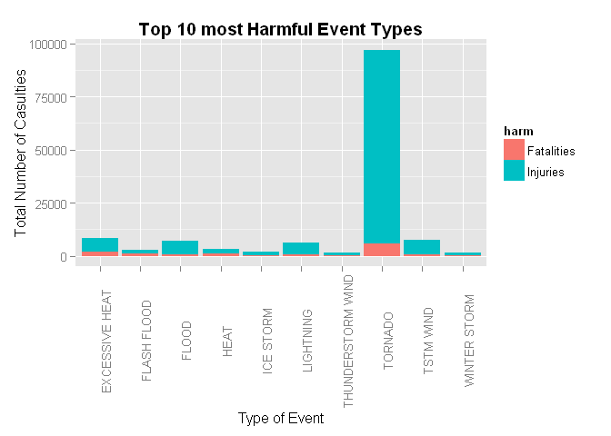

# United States Storm Analysis and Effects on Population and Economy
Rich Robinson  

# Synopsis
This analysis is going to use storm data provided by NOAA from 1950 to November 2011 to assess the impact these storms have had on the health of the population and the consequences to the economy.

# Data Processing

## Downloading & Reading the Data
The [NOAA Storm Database][1] tracks characteristics of major storms and weather events across the United States. It includes information on where and when they occur and estimates for fatalities, injuries and damage to properties. This data set containes information from 1950 to November 2011. At the start of the data set there are considerably records, however more recent entries are more complete.

[1]: https://d396qusza40orc.cloudfront.net/repdata%2Fdata%2FStormData.csv.bz2 "NOAA Storm Database"  

The data file is downloaded as part of this document (if not already available in the working directory), is named **"StormData.csv.bz2"** and is read into R by opening a bz file connection into the `read.csv` function. 


```r
zip_url <- "https://d396qusza40orc.cloudfront.net/repdata%2Fdata%2FStormData.csv.bz2"
bz_file <- "StormData.csv.bz2"

## Checking to see if required files are present
if (!file.exists(bz_file)){
  download.file(zip_url, destfile = bz_file)
}  
if (!exists("noaa_data")){
  noaa_data <- read.csv(bzfile(bz_file), header = TRUE, stringsAsFactors = FALSE)
}
```

## Analysing the Data Set

The data set is large and requires quite a lot of time to read in. There are a total of 902297 records and 37 variables.


```r
dim(noaa_data)
```

```
## [1] 902297     37
```

The heading for these variables are:

```r
names(noaa_data)
```

```
##  [1] "STATE__"    "BGN_DATE"   "BGN_TIME"   "TIME_ZONE"  "COUNTY"    
##  [6] "COUNTYNAME" "STATE"      "EVTYPE"     "BGN_RANGE"  "BGN_AZI"   
## [11] "BGN_LOCATI" "END_DATE"   "END_TIME"   "COUNTY_END" "COUNTYENDN"
## [16] "END_RANGE"  "END_AZI"    "END_LOCATI" "LENGTH"     "WIDTH"     
## [21] "F"          "MAG"        "FATALITIES" "INJURIES"   "PROPDMG"   
## [26] "PROPDMGEXP" "CROPDMG"    "CROPDMGEXP" "WFO"        "STATEOFFIC"
## [31] "ZONENAMES"  "LATITUDE"   "LONGITUDE"  "LATITUDE_E" "LONGITUDE_"
## [36] "REMARKS"    "REFNUM"
```
The variables of particular interest include:  

* EVTYPE
* FATALITIES
* INJURIES
* PROPDMG
* CROPDMG

# Event Serverity with respect to Public Health
To assess which events are most harmful to public health lets look at those events which have the highest number fatalities and injuries. First lets subset our data for the required fields and look into the different event types.


```r
library(dplyr)

health_d <- noaa_data %>% select(EVTYPE, FATALITIES, INJURIES)

n_evt <- length(unique(health_d$EVTYPE))
n_evt
```

```
## [1] 985
```

```r
head(unique(health_d$EVTYPE), n=10)
```

```
##  [1] "TORNADO"                   "TSTM WIND"                
##  [3] "HAIL"                      "FREEZING RAIN"            
##  [5] "SNOW"                      "ICE STORM/FLASH FLOOD"    
##  [7] "SNOW/ICE"                  "WINTER STORM"             
##  [9] "HURRICANE OPAL/HIGH WINDS" "THUNDERSTORM WINDS"
```
There are 985 different types of meteological events on record. The first ten of them are lsted above. Upon quick analysis of this list, some of the event types appear to be summaries of events of specific events. Examples are shown below.

```r
library(stringr)
## extract examples of 'summary' event types

reg_exp <- "^[Ss]ummary"
sum_evts <- health_d %>% filter(str_detect(EVTYPE, reg_exp))
num_sum_evts <- length(sum_evts$EVTYPE)
uni_num_sum_evts <- length(unique(sum_evts$EVTYPE))
head(sum_evts$EVTYPE, n=9)
```

```
## [1] "Summary Jan 17"       "Summary of March 14"  "Summary of March 23" 
## [4] "Summary of March 24"  "Summary of April 3rd" "Summary of April 12" 
## [7] "Summary of April 13"  "Summary of April 21"  "Summary August 11"
```

```r
num_sum_evts
```

```
## [1] 72
```

```r
uni_num_sum_evts
```

```
## [1] 63
```
The code chunk above shows the first nine *"summary"* records within our data set. There are a total of 72 summary records, of which 63 are unique.  
We will omit these records from our analysis as it is likely they will be a replication of data already in our subset under the specific meteological event's record. Duplication of values would skew our results.

```r
options(scipen=1)
## we negate the outcome of 'str_detect' because we want records which are
## not 'summary' records.
health_d2 <- health_d %>% filter(!str_detect(EVTYPE, reg_exp))

res_health <- health_d2 %>% group_by(EVTYPE) %>% summarise(harm = sum(FATALITIES)+sum(INJURIES))
res_health <- res_health %>% arrange(desc(harm))
head(res_health, n=10)
```

```
## Source: local data frame [10 x 2]
## 
##               EVTYPE  harm
## 1            TORNADO 96979
## 2     EXCESSIVE HEAT  8428
## 3          TSTM WIND  7461
## 4              FLOOD  7259
## 5          LIGHTNING  6046
## 6               HEAT  3037
## 7        FLASH FLOOD  2755
## 8          ICE STORM  2064
## 9  THUNDERSTORM WIND  1621
## 10      WINTER STORM  1527
```
To assess the level of *harm* for each event type, the number of fatalities and injuries were added together. The above table shows the top 10 most harmful event types. The number one most harmful evet type is **TORNADO** with a total of **96979** fatalities and injuries.  


# Results

Analysis of effect on public health could include a plot with facets by event type of stacked bar plots (to show total of harm and proportion fatalaties/health). Certainly this shoud be for only non-zero event types, of which there are 220. But 220 is a lot of plots, so maybe we should focus on a sub-set (10, 15, 20???). By using stacked bar plots we can discuss which events have the overal most harm, but also look into those which have the most fatalities or most injuries. 


```r
library(ggplot2)
library(tidyr) ## required to reshape data from wide to long format

res_health2 <- health_d2 %>% group_by(EVTYPE) %>% summarise(Fatalities = sum(FATALITIES), Injuries = sum(INJURIES))

## selecting data to plot from the top 10 most 'harmful' event types as in res_health from earlier.
top10 <- res_health2 %>% filter((Fatalities + Injuries) >= res_health$harm[10])
top10
```

```
## Source: local data frame [10 x 3]
## 
##               EVTYPE Fatalities Injuries
## 1     EXCESSIVE HEAT       1903     6525
## 2        FLASH FLOOD        978     1777
## 3              FLOOD        470     6789
## 4               HEAT        937     2100
## 5          ICE STORM         89     1975
## 6          LIGHTNING        816     5230
## 7  THUNDERSTORM WIND        133     1488
## 8            TORNADO       5633    91346
## 9          TSTM WIND        504     6957
## 10      WINTER STORM        206     1321
```

```r
## This data is in a wide format. It would be better for plotting in a long format.
top10_long <- gather(top10, "harm", "count", Fatalities:Injuries)
g1 <- ggplot(top10_long, aes(x=EVTYPE, y=count, fill=harm)) + geom_bar(stat="identity")
g1 <- g1 + theme(axis.text.x = element_text(angle=90, vjust=1))
g1 <- g1 + labs(title = "Top 10 most Harmful Event Types") + xlab("Type of Event") + ylab("Total Number of Casulties") + theme(plot.title = element_text(face="bold"))
g1
```

 
