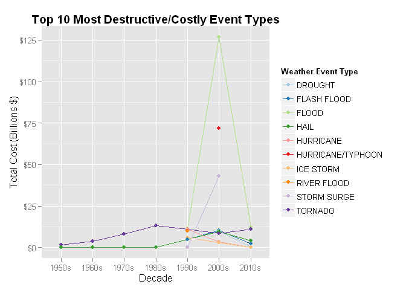

# United States Storm Analysis and Effects on Population and Economy
Rich Robinson  

# Synopsis
This analysis is going to use storm data provided by NOAA from 1950 to November 2011 to assess the impact these storms have had on the health of the population and the consequences to the economy.

# Data Processing

## Downloading & Reading the Data
The [NOAA Storm Database][1] tracks characteristics of major storms and weather events across the United States. It includes information on where and when they occur and estimates for fatalities, injuries and damage to properties. This data set containes information from 1950 to November 2011. At the start of the data set there are considerably records, however more recent entries are more complete.

[1]: https://d396qusza40orc.cloudfront.net/repdata%2Fdata%2FStormData.csv.bz2 "NOAA Storm Database"  

The data file is downloaded as part of this document (if not already available in the working directory), is named **"StormData.csv.bz2"** and is read into R by opening a bz file connection into the `read.csv` function. 


```r
zip_url <- "https://d396qusza40orc.cloudfront.net/repdata%2Fdata%2FStormData.csv.bz2"
bz_file <- "StormData.csv.bz2"

## Checking to see if required files are present
if (!file.exists(bz_file)){
  download.file(zip_url, destfile = bz_file)
}  
if (!exists("noaa_data")){
  noaa_data <- read.csv(bzfile(bz_file), header = TRUE, stringsAsFactors = FALSE)
}
```

## Analysing the Data Set

The data set is large and requires quite a lot of time to read in. There are a total of 902297 records and 37 variables.


```r
dim(noaa_data)
```

```
## [1] 902297     37
```

The heading for these variables are:

```r
names(noaa_data)
```

```
##  [1] "STATE__"    "BGN_DATE"   "BGN_TIME"   "TIME_ZONE"  "COUNTY"    
##  [6] "COUNTYNAME" "STATE"      "EVTYPE"     "BGN_RANGE"  "BGN_AZI"   
## [11] "BGN_LOCATI" "END_DATE"   "END_TIME"   "COUNTY_END" "COUNTYENDN"
## [16] "END_RANGE"  "END_AZI"    "END_LOCATI" "LENGTH"     "WIDTH"     
## [21] "F"          "MAG"        "FATALITIES" "INJURIES"   "PROPDMG"   
## [26] "PROPDMGEXP" "CROPDMG"    "CROPDMGEXP" "WFO"        "STATEOFFIC"
## [31] "ZONENAMES"  "LATITUDE"   "LONGITUDE"  "LATITUDE_E" "LONGITUDE_"
## [36] "REMARKS"    "REFNUM"
```
The variables of particular interest include:  

* BGN_DATE
* EVTYPE
* FATALITIES
* INJURIES
* PROPDMG
* CROPDMG

## Event Severity with respect to Public Health
To assess which events are most harmful to public health lets look at those events which have the highest number fatalities and injuries. First lets subset our data for the required fields and look into the different event types.


```r
library(dplyr)

health_d <- noaa_data %>% select(EVTYPE, FATALITIES, INJURIES)

n_evt <- length(unique(health_d$EVTYPE))
n_evt
```

```
## [1] 985
```

```r
head(unique(health_d$EVTYPE), n=10)
```

```
##  [1] "TORNADO"                   "TSTM WIND"                
##  [3] "HAIL"                      "FREEZING RAIN"            
##  [5] "SNOW"                      "ICE STORM/FLASH FLOOD"    
##  [7] "SNOW/ICE"                  "WINTER STORM"             
##  [9] "HURRICANE OPAL/HIGH WINDS" "THUNDERSTORM WINDS"
```
There are 985 different types of meteological events on record. The first ten of them are lsted above. Upon quick analysis of this list, some of the event types appear to be summaries of events of specific events. Examples are shown below.

```r
library(stringr)
## extract examples of 'summary' event types

reg_exp <- "^[Ss]ummary"
sum_evts <- health_d %>% filter(str_detect(EVTYPE, reg_exp))
num_sum_evts <- length(sum_evts$EVTYPE)
uni_num_sum_evts <- length(unique(sum_evts$EVTYPE))
head(sum_evts$EVTYPE, n=9)
```

```
## [1] "Summary Jan 17"       "Summary of March 14"  "Summary of March 23" 
## [4] "Summary of March 24"  "Summary of April 3rd" "Summary of April 12" 
## [7] "Summary of April 13"  "Summary of April 21"  "Summary August 11"
```

```r
num_sum_evts
```

```
## [1] 72
```

```r
uni_num_sum_evts
```

```
## [1] 63
```
The code chunk above shows the first nine *"summary"* records within our data set. There are a total of 72 summary records, of which 63 are unique.  
We will omit these records from our analysis as it is likely they will be a replication of data already in our subset under the specific meteological event's record. Duplication of values would skew our results.

```r
options(scipen=1)
## we negate the outcome of 'str_detect' because we want records which are
## not 'summary' records.
health_d2 <- health_d %>% filter(!str_detect(EVTYPE, reg_exp))

res_health <- health_d2 %>% group_by(EVTYPE) %>% summarise(harm = sum(FATALITIES)+sum(INJURIES))
res_health <- res_health %>% arrange(desc(harm))
head(res_health, n=10)
```

```
## Source: local data frame [10 x 2]
## 
##               EVTYPE  harm
## 1            TORNADO 96979
## 2     EXCESSIVE HEAT  8428
## 3          TSTM WIND  7461
## 4              FLOOD  7259
## 5          LIGHTNING  6046
## 6               HEAT  3037
## 7        FLASH FLOOD  2755
## 8          ICE STORM  2064
## 9  THUNDERSTORM WIND  1621
## 10      WINTER STORM  1527
```
To assess the level of *harm* for each event type, the number of fatalities and injuries were added together. The above table shows the top 10 most harmful event types. The number one most harmful evet type is **TORNADO** with a total of **96979** fatalities and injuries.  

## Economic Consequences of Severe Weather Events
To investigate which severe weather events have greatest economic consequences, let us consider the values of damage done to property and to crops. As before, first lets subset our complete data set for the following variabes of intrest:

* BGN_DATE
* EVTYPE
* PROPDMG
* PROPDMGEXP
* CROPDMG
* CROPDMGEXP

The date of the event can be of interest so we can look at changes in economic damage over time. Of all the date information available in the data set, we will only conside the date when the event started to categorise the time period the event belongs in. This will remove problems when an event persists across years.  
To investigate this query, the data processing has been completed using the `data.table` package as it is very efficient and concise when coding.


```r
library(data.table)
## creating a data.table version of the original data for efficient processing

noaa_dt <- data.table(noaa_data)

## Selecting only the required variables
eco1_dt <- noaa_dt[, .(BGN_DATE, EVTYPE, PROPDMG, PROPDMGEXP, CROPDMG, CROPDMGEXP)]

## Removing the 'summary' records as definer earlier
#eco_dt <- eco1_dt[ EVTYPE == sum_evts$EVTYPE] #<- not working correctly
eco_dt <- eco1_dt %>% filter(!str_detect(EVTYPE, reg_exp))
```
Again the *'summary'* event records were removed as their values will be duplicated in the associated event record.  
In the original data set, the dates are `string` arrays. To copute them easier, it is better that they are variables of the `Date` class.

```r
## converting the date variable from a string to the Date class
eco_dt[, BGN_DATE := as.Date(BGN_DATE, "%m/%d/%Y")]
```

```
##           BGN_DATE     EVTYPE PROPDMG PROPDMGEXP CROPDMG CROPDMGEXP
##      1: 1950-04-18    TORNADO    25.0          K       0           
##      2: 1950-04-18    TORNADO     2.5          K       0           
##      3: 1951-02-20    TORNADO    25.0          K       0           
##      4: 1951-06-08    TORNADO     2.5          K       0           
##      5: 1951-11-15    TORNADO     2.5          K       0           
##     ---                                                            
## 902221: 2011-11-30  HIGH WIND     0.0          K       0          K
## 902222: 2011-11-10  HIGH WIND     0.0          K       0          K
## 902223: 2011-11-08  HIGH WIND     0.0          K       0          K
## 902224: 2011-11-09   BLIZZARD     0.0          K       0          K
## 902225: 2011-11-28 HEAVY SNOW     0.0          K       0          K
```

```r
## Grouping Dates into Decades for later comparison
decs_seq <- seq(as.Date("01/01/1950", "%m/%d/%Y"), length.out=8, by="10 year")
dec_labs <- c("1950s", "1960s", "1970s", "1980s", "1990s", "2000s", "2010s")
eco_dt[, DECADE := cut(BGN_DATE, decs_seq, labels = dec_labs)]
```

```
##           BGN_DATE     EVTYPE PROPDMG PROPDMGEXP CROPDMG CROPDMGEXP DECADE
##      1: 1950-04-18    TORNADO    25.0          K       0             1950s
##      2: 1950-04-18    TORNADO     2.5          K       0             1950s
##      3: 1951-02-20    TORNADO    25.0          K       0             1950s
##      4: 1951-06-08    TORNADO     2.5          K       0             1950s
##      5: 1951-11-15    TORNADO     2.5          K       0             1950s
##     ---                                                                   
## 902221: 2011-11-30  HIGH WIND     0.0          K       0          K  2010s
## 902222: 2011-11-10  HIGH WIND     0.0          K       0          K  2010s
## 902223: 2011-11-08  HIGH WIND     0.0          K       0          K  2010s
## 902224: 2011-11-09   BLIZZARD     0.0          K       0          K  2010s
## 902225: 2011-11-28 HEAVY SNOW     0.0          K       0          K  2010s
```

```r
d1 <- eco_dt[, BGN_DATE][1] ## First date
dx <- eco_dt[, BGN_DATE][dim(eco_dt)[1]] ## Last date
yrs <- length(seq(d1, dx, by="year")) ## Calculate number of years
```
The first record date is: 1950-04-18 and the last record date is: 2011-11-28 which spans a total of 62. Since this spans a long time period, it might be more convenient for a quick analysis to reduce the resolution by looking at the values across each decade. In order to achieve this the continuous dates values were converted into descrite decade values using a factor variable. The code chunck below shows the first six records and illustrates how a new factor variable `DECADE` has been created.

```r
head(eco_dt)
```

```
##      BGN_DATE  EVTYPE PROPDMG PROPDMGEXP CROPDMG CROPDMGEXP DECADE
## 1: 1950-04-18 TORNADO    25.0          K       0             1950s
## 2: 1950-04-18 TORNADO     2.5          K       0             1950s
## 3: 1951-02-20 TORNADO    25.0          K       0             1950s
## 4: 1951-06-08 TORNADO     2.5          K       0             1950s
## 5: 1951-11-15 TORNADO     2.5          K       0             1950s
## 6: 1951-11-15 TORNADO     2.5          K       0             1950s
```
The values of property damage and crop damage have been abbreviated by removing the denonimation of ten, i.e. hundred, thousand, million, billion. In order to compare the economic costs correctly these need to be reinstated, so that 1.5K becomes 1500.

```r
## defining a function to perform the multiplication

multi10 <- function(x, mul){
  # first check to see if multiplier is a number between 1 and 9, in character form
  if(is.null(mul)) return(x * 10^0) # return default value
  
  if(mul %in% as.character(1:9)) mul <- "num"
  
  switch(mul,
         B={ # billions
           return(x * 10^9)
         },
         b={ # billions
           return(x * 10^9)
         },
         M={ # millions
           return(x * 10^6)
         },
         m={ # millions
           return(x * 10^6)
         },
         K={ # thousands
           return(x * 10^3)
         },
         k={ # thousands
           return(x * 10^3)
         },
         H={ # hundreds
           return(x * 10^2)
         },
         h={ # hundreds
           return(x * 10^2)
         },
         num={ # unit value
           return(x * 10^1)
         },
         { # default
           return(x * 10^0)
         }
         )
}
```
The function above has two arguements. The first (`x`) is the value to be multiplied and the second (`mul`) is the multiplier to apply. A switch statement acting on `mul` will then choose the appropriate calculation. However, due to how the `switch` function works in `R`, firstly a check to see if the multiplier is a numerial between 1 and 9 in needed. Any other characters are treated by the default case.

```r
## mutating the values in PROPDMG & CROPDMG into their full form
eco_dt[, PROPDMG := mapply(multi10, PROPDMG, PROPDMGEXP)]

eco_dt[, CROPDMG := mapply(multi10, CROPDMG, CROPDMGEXP)]
```
Two new data tables are created below. The first computes the total (economic) destruction for each event type for by decade. The total destruction is defined as the sum of property damage and crop damage *(combined destruction)*. The second data table is the total destruction, defined similarly, over the whole of the data set *(total destruction)*.

```r
## Computing the total destruction of each event type by decade
dest_decs <- eco_dt[, .(COMB_DEST = sum(PROPDMG) + sum(CROPDMG)), by=.(EVTYPE, DECADE)][order(DECADE, -COMB_DEST)]
## used data.table chaining to re-order the results for readability

## Computing the total (economic) destruction for each event type over whole date range
dest_all <- eco_dt[, .(TOTAL_DEST = sum(PROPDMG) + sum(CROPDMG)), by=EVTYPE][order(-TOTAL_DEST)]

head(dest_decs)
```

```
##       EVTYPE DECADE  COMB_DEST
## 1:   TORNADO  1950s 1516409420
## 2: TSTM WIND  1950s          0
## 3:      HAIL  1950s          0
## 4:   TORNADO  1960s 3757536860
## 5: TSTM WIND  1960s          0
## 6:      HAIL  1960s          0
```

```r
head(dest_all)
```

```
##               EVTYPE   TOTAL_DEST
## 1:             FLOOD 150319678257
## 2: HURRICANE/TYPHOON  71913712800
## 3:           TORNADO  57352114969
## 4:       STORM SURGE  43323541000
## 5:              HAIL  18758222286
## 6:       FLASH FLOOD  17562129965
```


# Results

## Effects on Public Health

Analysis of effect on public health could include a plot with facets by event type of stacked bar plots (to show total of harm and proportion fatalaties/health). Certainly this shoud be for only non-zero event types, of which there are 220. But 220 is a lot of plots, so maybe we should focus on a sub-set (10, 15, 20???). By using stacked bar plots we can discuss which events have the overal most harm, but also look into those which have the most fatalities or most injuries. 


```r
library(ggplot2)
library(tidyr) ## required to reshape data from wide to long format

res_health2 <- health_d2 %>% group_by(EVTYPE) %>% summarise(Fatalities = sum(FATALITIES), Injuries = sum(INJURIES))

## selecting data to plot from the top 10 most 'harmful' event types as in res_health from earlier.
top10 <- res_health2 %>% filter((Fatalities + Injuries) >= res_health$harm[10])
top10
```

```
## Source: local data frame [10 x 3]
## 
##               EVTYPE Fatalities Injuries
## 1     EXCESSIVE HEAT       1903     6525
## 2        FLASH FLOOD        978     1777
## 3              FLOOD        470     6789
## 4               HEAT        937     2100
## 5          ICE STORM         89     1975
## 6          LIGHTNING        816     5230
## 7  THUNDERSTORM WIND        133     1488
## 8            TORNADO       5633    91346
## 9          TSTM WIND        504     6957
## 10      WINTER STORM        206     1321
```

```r
## This data is in a wide format. It would be better for plotting in a long format.
top10_long <- gather(top10, "harm", "count", Fatalities:Injuries)
g1 <- ggplot(top10_long, aes(x=EVTYPE, y=count, fill=harm)) + geom_bar(stat="identity")
g1 <- g1 + theme(axis.text.x = element_text(angle=90, vjust=1))
g1 <- g1 + labs(title = "Top 10 most Harmful Event Types") + xlab("Type of Event") + ylab("Total Number of Casulties") + theme(plot.title = element_text(face="bold"))
g1
```

 

## Economic Consequences

To assess the economic consequences of the recorded severe weather events the data set has been processed to analyise the amount of property damage and crop damage. There are a total of 913 different event types, which would be a lot to plot so we'll focus on the top ten. To define which are the top ten event types we'll consider the total economic (property damage + crop damage) cost over the data set.


```r
library(scales)
top_evts <- dest_all[, EVTYPE][1:10]

## subsetting out the top 10 event types from the data over each decade
eco_t10 <- dest_decs[EVTYPE %in% top_evts]

## plotting the economic cost over decade for each event type
#g2 <- ggplot(eco_t10, aes(x=DECADE, y=COMB_DEST)) + geom_line() + facet_wrap( ~ EVTYPE, ncol=5)
g2 <- ggplot(eco_t10, aes(x=DECADE, y=COMB_DEST/10^9, group=EVTYPE, color=EVTYPE)) + geom_line() + geom_point()

g2 <- g2 + labs(title="Top 10 Most Destructive/Costly Event Types") + xlab("Decade") + ylab("Total Cost (Billions $)") + theme(plot.title = element_text(face="bold")) + scale_y_continuous(labels = dollar, breaks = seq(0, 125, 25))

g2 <- g2 + scale_colour_brewer(palette="Paired", name="Weather Event Type")

g2
```


It is clear to see that not much data was available prior to the 1990s. This is possibly due to the lack of infrustructure of weather monitoring equipment and lack of good recording processes. Thus only more large scale events would have been recorded.
There is a large peak in the values for the 2000s decade. This is highly likely due to the massive effects of Hurricane Katrina in 2005.
Also, the values for the 2010 decade are low because the is only two years of data collected within this caregory.  
But now lets look at the overall data.


```r
library(xtable)
xtab10 <- dest_all[1:10]

xtab10[, TOTAL_DEST := TOTAL_DEST/10^9]
```

               EVTYPE TOTAL_DEST
 1:             FLOOD 150.319678
 2: HURRICANE/TYPHOON  71.913713
 3:           TORNADO  57.352115
 4:       STORM SURGE  43.323541
 5:              HAIL  18.758222
 6:       FLASH FLOOD  17.562130
 7:           DROUGHT  15.018672
 8:         HURRICANE  14.610229
 9:       RIVER FLOOD  10.148404
10:         ICE STORM   8.967041

```r
setnames(xtab10, c("EVTYPE", "TOTAL_DEST"), c("Event Type", "Cost ($ Billions)"))

xt <- xtable(xtab10, caption="10 Most Destructive Event Types from 1950 to 2011", digits=2)

print(xt, type="html")
```

<!-- html table generated in R 3.1.2 by xtable 1.7-4 package -->
<!-- Sun Mar 22 23:38:12 2015 -->
<table border=1>
<caption align="bottom"> 10 Most Destructive Event Types from 1950 to 2011 </caption>
<tr> <th>  </th> <th> Event Type </th> <th> Cost ($ Billions) </th>  </tr>
  <tr> <td align="right"> 1 </td> <td> FLOOD </td> <td align="right"> 150.32 </td> </tr>
  <tr> <td align="right"> 2 </td> <td> HURRICANE/TYPHOON </td> <td align="right"> 71.91 </td> </tr>
  <tr> <td align="right"> 3 </td> <td> TORNADO </td> <td align="right"> 57.35 </td> </tr>
  <tr> <td align="right"> 4 </td> <td> STORM SURGE </td> <td align="right"> 43.32 </td> </tr>
  <tr> <td align="right"> 5 </td> <td> HAIL </td> <td align="right"> 18.76 </td> </tr>
  <tr> <td align="right"> 6 </td> <td> FLASH FLOOD </td> <td align="right"> 17.56 </td> </tr>
  <tr> <td align="right"> 7 </td> <td> DROUGHT </td> <td align="right"> 15.02 </td> </tr>
  <tr> <td align="right"> 8 </td> <td> HURRICANE </td> <td align="right"> 14.61 </td> </tr>
  <tr> <td align="right"> 9 </td> <td> RIVER FLOOD </td> <td align="right"> 10.15 </td> </tr>
  <tr> <td align="right"> 10 </td> <td> ICE STORM </td> <td align="right"> 8.97 </td> </tr>
   </table>

```r
options(digits = 2)
```
The table above show that the most destructive (in economic terms) event type is FLOOD with a total of $150.32 Billion.
